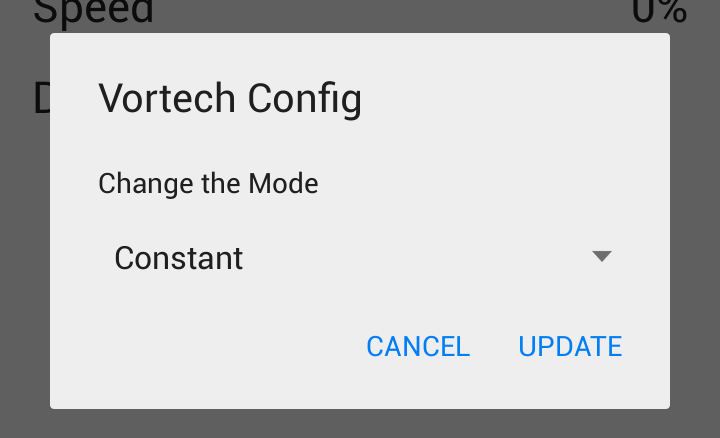
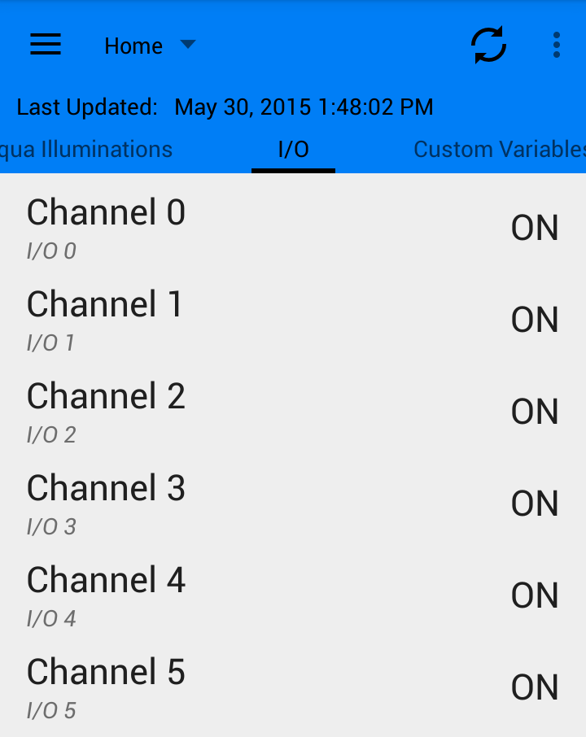
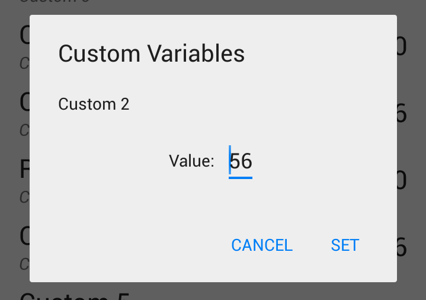
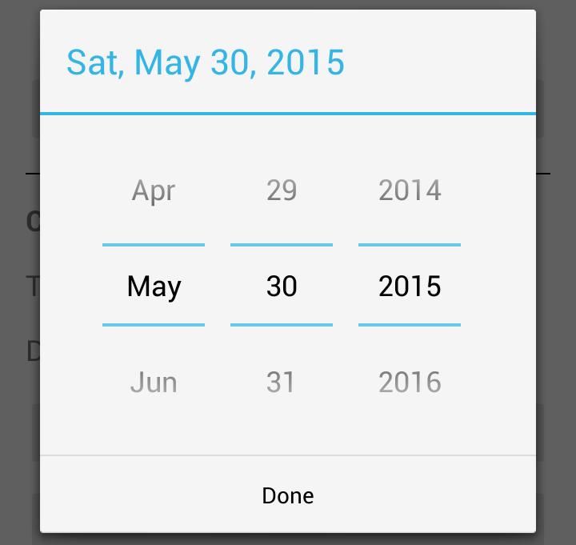

# Android Status

This application is designed to communicate with the Reef Angel Controller. It gives you complete control over your controller. You are able to get the status of your controller from the Controller itself or from the Reef Angel Portal. *Note: The WIFI module must be installed on the controller in order to use this app.*

Communicating with the Portal limits you to only being able to monitor the status. This is due to the limitations of the Portal. The Portal only allows you to get data from it. It does not allow you to send commands to it and have it relay the commands to the Controller. If you desire to control your controller from this app, you must communicate with it directly.

If you are communicating with your controller directly, in addition to being able to get the status, you will be able to:
- Update Internal Memory values
- Update the date and time
- Enter/Exit Feeding and Water Change modes
- Toggle ports ON/OFF
- Change values and modes for: Dimming (Standard and 16 channel), Vortech, Aqua Illuminations, DC Pump, Radion, I/O, Custom Variables
- Clear the ATO and/or Overheat Flags
- Launch the calibration modes for:  PH, PH Expansion, Salinity, ORP, Water Level

The app allows for Notifcations to be set no matter how you communicate. The notifications are based on the status of the parameters. The notifications are displayed as system notifications. Some examples are:
- Temperature 1 probe exceeds 85 degrees
- Water Level falls below 10%
- PH rises above 8.30
- Salinity falls below 32 ppt

This project initially started in 2011. The first release, v0.1, was released on October 30, 2011.
Current Release:  **2.0**
The application was created using Android Studio. Full source code of the application is available on Github at:  https://github.com/curtbinder/AndroidStatus
This application is released under the MIT License.

## Requirements
A WIFI module installed on the controller is required. Without the module, there is no way to communicate with the controller.
This application will run on Android 4.0 or later. If you have an older device, you cannot run the most recent version of this application. You will only be able to install version 1.0 or earlier. The older versions of the software are available at:  http://curtbinder.info/apps/

It requires the following permissions in Android:
- **android.permission.ACCESS_NETWORK_STATE** - To detect if the network is available to communicate.
- **android.permission.INTERNET** - To use internet for communications with the controller or portal.
- **android.permission.READ_EXTERNAL_STORAGE** - To read the log file on the external storage.
- **android.permission.RECEIVE_BOOT_COMPLETED** - To be able to start the autoupdate service when device boots.
-  **android.permission.WRITE_EXTERNAL_STORAGE** - To write to the log file on the external storage.

## Application
There is a Navigation Drawer available by swiping from the left side of the screen. This Navigation Drawer allows you to change the section of the application. The default section is the **Status** section.

The toolbar contains important actions. (From Left to Right)
- Hamburger Icon - This exposes the Navigation Drawer when tapped.
- Navigation Menu - This allows you to change profiles between Home and Away (if enabled). By default, the Home profile is selected. If you only have Home profile enabled, it will be the only option in the list.
- Refresh Button - This refreshes the data from the controller or portal using the specified host selected in the Navigation Menu to the left.
- Options Button - This allows you to open the Settings page.

Some of the action buttons change based on the section of the app you are in. The changes will be noted in each section listed below.

Below the Toolbar, is a Last Updated line. This contains the last date and time the app communicated with the controller. It also shows the status during the communication process. If an error occurs during communication, it will be displayed here as well as with a system notification.

The Back button takes you to the previous sections. Once on the Status section, the back button will exit the application.

### Status
This is the main / default section of the application. The status of the controller is obtained here. The following pages are available based on the configuration of your controller. By default, they are shown according to the configuration of the controller. If you update the code on your controller to add or remove a module or feature, the next time this app connects to the controller for the status, the modules will be updated accordingly. This Auto Update functionality can be changed in the Preferences (described below).

Page navigation is handled by swiping left or right to change the pages.

Action Buttons:  **Refresh Button**
#### Flags
These are the flags displayed from the controller. There are 2 statuses: OFF (in green text) and ON (in red text). In the picture below, you can see that the controller is currently in Feeding Mode.

##### Alert Flags
- ATO Timeout - indicates that an ATO timeout occurred.
- Overheat Timeout - indicates that an Overheat timeout occurred.
- Bus Lock - indicates that a Bus Lock has occurred.
- Leak - indicates that a Leak has been detected by the Leak Detector module.

##### Status Flags
- Lights On - indicates that the current controller status is Lights On.
- Feeding Mode - indicates that the controller is currently in Feeding Mode.
- Water Change Mode - indicates that the controller is currently in Water Change Mode.

#### Commands
This screen allows you to issue commands to the controller. Not all commands fit on the screen at once and the page has to be scrolled up to view the rest of the commands.

The following commands are available:
- Feeding Mode - Puts the controller in Feeding Mode.
- Water Change Mode - Puts the controller in Water Change Mode.
- Exit Mode - Exits the current mode on the controller.
- Reboot - Forces the controller to reboot. The reboot will take place in approximately a couple seconds.
- Lights On - Puts the controller in the Lights On mode, ie Turns on the lights.
- Lights Off - Puts the controller in the Lights Off mode, it Turns off the lights.
- Clear ATO - Clears the ATO Timeout alert flag.
- Clear Overheat - Clears the Overheat Timeout alert flag.
- Calibrate PH - Puts the controller in the Calibration Mode for the PH probe.
- Calibrate PH Exp - Puts the controller in the Calibration Mode for the PH Expansion probe.
- Calibrate Salinity - Puts the controller in the Calibration Mode for the Salinity Expansion probe.
- Calibrate ORP - Puts the controller in the Calibration Mode for the ORP Expansion probe.
- Calibrate Water Level - Puts the controller in the Calibration Mode for the Water Level Expansion modules.
- Get RA Version - Obtains the version of the libraries installed on the controller and changes the button text to display the version.

#### Controller (Default Screen)
This is the default screen for the app. It displays the basic status information for the controller. Not all parameters will fit on the screen. You will have to scroll the page up to display all the parameters if they are not visible. In this picture, you can see that the Daylight Channel (DP) has its value overridden manually. This is indicated by the double asterisk in front of the value. This is explained in the note below.

Parameters available on this screen and what they reference:
- T1 - Temperature Sensor 1
- T2 - Temperature Sensor 2
- T3 - Temperature Sensor 3
- PH - PH Probe built-in to the controller
- DP - Daylight PWM Channel
- AP - Actinic PWM Channel
- ATO Low
- ATO High
- Salinity - Salinity Expansion Module
- ORP - ORP Expansion Module
- PH Exp - PH Expansion Module
- Water Level - Single Channel Water Level Expansion Module
- Water Level 1 - Multi Channel Water Level Expansion Module
- Water Level 2 - Multi Channel Water Level Expansion Module
- Water Level 3 - Multi Channel Water Level Expansion Module
- Water Level 4 - Multi Channel Water Level Expansion Module
- Humidity - Humidity Expansion Module

Long Press options:
- Daylight Channel (DP) - Displays a dialog to manually override the PWM value or clear the override.
	
- Actinic Channel (AP) - Displays a dialog to manually override the PWM value or clear the override. *Note: This looks almost identical to the Daylight Channel dialog.*

*Note: If the PWM values are manually overridden, a double asterisk (`**`) will be displayed in front (before) the value.*

#### Main Relay
This displays the status of the individual ports on the Main Relay box. Each port is on a separate row. Each row has several views/controls in it that refer to different things. From Left to Right, they are:
- Title - The label for the port. This can be manually set in the preferences or downloaded from the Portal.
- Subtitle - This is just below the Title. The text is slightly smaller and is italicized. This indicates the actual port on the relay box. This value cannot be changed.
- Override Circle - If this green circle is displayed, this indicates that the status of the port has been manually changed. This means that you have told the controller you want the port to be either ON or OFF and to ignore the programming on the controller. If this green circle is shown, the port will stay in its current status (ON/OFF) and will not change based on the controllers programming. Overriding a port can be useful if you are removing equipment or are manually testing that the port works. ***When you want the port to return to its normal Auto functioning mode (ie, not overridden and following the programming on the controller), you just simply need to tap on the green circle and it will clear the manual override for the port.***
- Status Toggle - This displays the current status of the port. The toggle button will display ON or OFF depending on the state of the port. By default, the port will be in Auto mode, which means it is following the programming logic on the controller. If you want to force the port ON or OFF, you simply tap on the toggle button and it will either manually turn the port ON or OFF. When it does, it will display a green override cirle (mentioned above) that indicates the port status is being overridden. When it is overridden, you can manually change the status by tapping the button and you will see the status change from ON to OFF and vice versa.

Here is a full view of the screen displaying all 8 ports for the Relay. As you can see, the ports are labeled and below each label is the actual port number. You can see that Port 2 (the WM left device) is manually turned OFF. The toggle button indicates it is OFF and the green circle indicates that it is manually turned off. You can also see that Port 6 (the WM right device) is also turned OFF but it is supposed to be off based on the controller programming. This is indicated by no green circle next to the toggle button. Only Port 2 has been manually turned off out of all 8 ports.
The last thing to point out is Port 5 (the N/A device) is DISABLED. The toggle button is grayed out and cannot be selected. This is a result from Port 5 being Disabled from the Enabled Ports section in the Preferences.

#### Expansion Relay 1 through 8
These pages function the same as the Main Relay. They are just for the specified Expansion Relay.

#### Dimming
This is the standard 6 channel dimming expansion module.

Channels Available: 0 through 5
Long Press options:
- All Channels - Displays a dialog to manually override the PWM value or clear the override.
	

*Note: If the PWM values are manually overridden, a double asterisk (`**`) will be displayed in front (before) the value.*

#### 16 Ch Dimming
This is the custom 16 channel dimming expansion module. Not all the channels will fit on the screen and the screen must be scrolled up to view the rest of the channels.

Channels Available: 0 through 15
Long Press options:
- All Channels - Displays a dialog to manually override the PWM value or clear the override.
	

*Note: If the PWM values are manually overridden, a double asterisk (`**`) will be displayed in front (before) the value.*

#### Radion
This uses the RF Expansion Module to control all channels and intensity of the Radion XR30w LED Fixture.

Channels Available: White, Royal Blue, Red, Green Blue, Intensity
Long Press options:
- All Channels - Displays a dialog to manually override the PWM value or clear the override.
	

*Note: If the PWM values are manually overridden, a double asterisk (`**`) will be displayed in front (before) the value.*

#### Vortech
This uses the RF Expansion Module to control the Ecotech Vortech pumps with the ES wireless drivers.

Modes: Constant, Lagoonal, Reef Crest, Short Wave, Long Wave, Nutrient, Tidal Swell, Feeding Start, Feeding Stop, Night, Storm, Custom
Speed: 0-100%
Duration: 0-255

Long Press options:
- Mode - Displays a dialog with a drop down menu to change the mode.
	
- Speed - Displays a dialog with a slider to change the speed, in percentage from 0-100.
	
- Duration - Displays a dialog with a slider to change the duration value from 0-255. *Note: This looks almost identical to the Speed dialog.*

#### DC Pump
This page is used to control a DC Pump. More details on the specifics of the DC Pump can be found on the forum.

Modes: Constant, Lagoon, Reef Crest, Short Pulse, Long Pulse, Nutrient, Tidal Swell, Custom, Else, Sine, Gyre
Speed: 0-100%
Duration: 0-255
Threshold: 0-100

Long Press options:
- Mode - Displays a dialog with a drop down menu to change the mode.
	
- Speed - Displays a dialog box with a slider to change the speed, in percentage from 0-100.
	
- Duration - Displays a dialog box with a slider to change the duration value from 0-255.
	
- Threshold - Displays a dialog box with a slider to change the threshold value from 0-100. *Note: This looks almost identical to the Duration dialog except with a smaller range.*

#### Aqua Illuminations
Requires the Aqua Illumination Cable Attachment that connects to any available ATO port to allow full control of all three channels of either the Aqua Illumination Nano or Sol fixtures.

Channels Available: White, Blue, Royal Blue
Long Press options:
- All Channels - Displays a dialog to manually override the PWM value or clear the override.
	

*Note: If the PWM values are manually overridden, a double asterisk (`**`) will be displayed in front (before) the value.*

#### I/O
This page shows you the status of the 6 additional I/O channels that are from the I/O Expansion module. This page shows whether the channel is ON or OFF.

#### Custom Variables
The controller has the ability to monitor up to 8 custom variables that can be used inside your code. The values of the variables are displayed here. Depending on how you code your controller, you could trigger certain events to occur on your controller based on the value that gets set to one of the variables. See the forum for more examples and ideas on how to use Custom Variables.

Long Press options:
- All Variables - Displays a dialog to manually change the value stored.
	

### Memory
This section allows you to read / write any Internal Memory location on the controller. You can choose from the pre-defined memory locations or you can enter your own location. 
If you choose to enter your own location, you need to specify:
- Location - Memory location to be accessed. The Reef Angel Plus can have locations from 0-4096.
- Type of value - This can be an INT or a BYTE.
	- INT requires 2 blocks and can be a value from 0-32767.
	- BYTE requires 1 block and can be a value from 0-255.

Once the memory location is selected, you can tap the:
- Read Value Button - This reads the value from the memory location and displays it in the Value edit box.
- Write Value Button - This writes the value entered in the Value edit box to the selected memory location.

Action Buttons:  **None**

### Notifications
This section allows you to create notifications based on parameter values. A list of your notifications are presented. You can Add a new notification by using the Add Action button in the toolbar. You can Edit existing notifications by tapping on them.

The notification displayed on in the image above checks to see if the Temp 1 value is greater than or equal to 72.0. If Temp 1 value is greater than or equal to 72.0, then a notification will be displayed in the system notification bar. If it is less than 72.0, no notification will be displayed. *Note: Notifications are checked ONLY when the status is updated. So it only occurs after the refresh button is tapped.*

On the Add or Update Notification dialog, you choose / select the following:
- Parameter - The parameter you wish to be notified. Options include:
> Temp 1, Temp 2, Temp 3, PH, PH Expansion, Daylight PWM, Actinic PWM, Salinity, ORP, Water Level, ATO High, ATO Low, Dimming PWM Expansion 0-5, Aqua Illuminations White, Aqua Illuminations Blue, Aqua Illuminations Royal Blue, Vortech Mode, Vortech Speed, Vortech Duration, Radion White, Radion Royal Blue, Radion Red, Radion Green, Radion Blue, Radion Intensity, IO 0-5, Custom Variable 0-7, Water Level 1-4, Humidity, 16 Ch Dimming PWM 0-15
- Condition - The condition to use when evaluating the notification. Options include:
	- `>` - Greater than
	- `>=` - Greater than or equal to
	- `=` - Equals
	- `<` - Less than
	- `<=` - Less than or equal to
	- `!=` - Not equals
- Value - The value to be used for the notification.

These read Parameter Condition Value. Here are some examples:
- Temp 2 `>` 100.0 - Is the value of the Temp 2 probe greater than 100?
- Custom 1 `=` 10 - Is the value of Custom Variable 1 equal to 10?
- Water Level `<=` 10 - Is the value of the Water Level less than or equal to 10%?
- PH `>` 8.30 - Is the value of the PH greater than 8.30?

Typically, you will want to use the `>`, `>=`, `<`, or `<=` conditions for evaluating values that can be above or below some threshold, such as temperatures, water levels, ph, salinity, etc.
The `=` and `!=` conditions will be used for evaluating if a value matches exactly or does not match at all, such as checking if an IO port is ON or if a Custom Variable is a specific value.

Here's the Add Notification Dialog:

Here's the Update Notification Dialog:

If you tap on the Delete (or Trash) button from the toolbar, you will be presented with an option to delete all the notifications.

Action Buttons:  **Add, Delete Buttons**

### History
The app saves the history of the status. The history is displayed here in a long list sorted descending with the most recent status displayed at the top of the list.

Each entry displays the Date and Time the status was obtained and then it displays the Temp 1, Temp 2, and Temp 3 values.

If you tap on the Delete (or Trash) button from the toolbar, you will be presented with an option to delete all the history.

Action Buttons:  **Delete Button**

### Errors
This section displays all errors that the app has encountered. They are displayed in a descending list with the most recent error being first.

If you have any notifications specified from the Notifications section, they will also be displayed in this list with the errors.

In this image, you can see there was a notification about the Temp 1 exceeding the specified value. (ie. 74.4 >= 72.0) The value 74.4 is greater than or equal to the value 72.0 and that triggered the notification.

If you tap on the Delete action button, you will be prompted about clearing all of the errors stored.

Action Buttons:  **Delete Button**

### Date and Time
This section allows you to update the date and time on your controller. There are several options on the screen and they will be explained.

In the top half of the screen, the section is titled Controller. There are 2 buttons under a Date and Time string. The buttons and their meanings are:
- Get Time - This button retrieves the current date and time from the controller and displays it on the screen.
- Set to Match Device - This button sets the controller's date and time to match the date and time on this device. This option allows you to quickly update the date and time, ie after Daylight Savings Time begins or ends.

In the bottom half of the screen, this section is titled Custom Controller Time. This section allows you to set a custom or specific date and time for your controller. This can be useful if you are testing a scenario in your code that happens at a specific time of day and you do not want to wait until that time comes.
It contains 3 buttons under a Time and Date label. The buttons and their meanings are:
- Choose Time - Displays a Time Picker dialog to select the custom Time.

	*Holo Theme*
    
	
    
    *Material Theme*
    
    
- Choose Date - Displays a Date Picker dialog to select the custom Date.

	*Holo Theme*
	
    
    
    *Material Theme*
    
    
- Set Custom Time - Sends the custom / specific date and time to the controller.

Action Buttons:  **None**

## Preferences
The app has a lot of preferences. When launching the Settings or Preferences, you are presented with this screen.

Each section is covered in detail below.

### Profiles
- **Device** - Selection between Controller or Portal
- **Device Authentication Username** - The username used for connecting to your controller. This is enabled in the code installed on your controller by using the following code (placed in your setup section and automatically added by the Wizard if enabled): `ReefAngel.Wifi.WifiAuthentication("username:password");`
- **Device Authentication Password** - The password used for connecting to your controller. See above for how to enable it.
- **Selected Profile** - Selection between Home and Away profiles.
- **Home Host** - IP or URL of your controller. This is typically either your local IP address or a dynamic dns name. This cannot be empty.
*Note: Enter the URL or IP only, do not enter http://*
If you are using the Reef Angel Dynamic DNS, you will have something like this this in the setup section of your code (it will be automatically added by the Wizard if enabled and the text will be different based on what you chose): `ReefAngel.DDNS("home");`
The Host that will be entered eitehr in the Home or Away host will be this: `username-home.myreefangel.com`  The username is your forum username and home is what you have listed in the DDNS line in your code. This example uses home (like displayed above).
- **Home Port** - The port the controller is set to listen on.
*Default: 2000*
- **Away Host** - IP or URL of your controller. This is typically either your public IP or dynamic dns name. To disable the Away profile, just remove the text in the dialog box and save it.
*Note: Enter the URL or IP only, do not enter http://*
- **Away Port** - The port the controller is set to listen on.
*Default: 2000*
- **User ID** - Your portal username. This is used to download your labels from the Portal. It is also used if you have Portal chosen as your device.

### Controller
- **Download** - Downloads all labels you have configured in the Portal using the User ID that you specified. The username/User ID that will be used to download the labels is specified in the summary text on the option.
- **Controller**
	- **Labels** - Allows you to set/update the labels for all the parameters that are associated with the base controller. The labels are: 
> Temp Sensor 1, Temp Sensor 2, Temp Sensor 3, PH, Daylight Channel, Actinic Channel, ATO Low, ATO High, Salinity, ORP, PH Expansion, Water Level, Water Level 1, Water Level 2, Water Level 3, Water Level 4, Humidity
	- **Visibility** - Allows you to toggle which parameters are visible on the Controller page of the app. The options are: 
> Temp Sensor 2, Temp Sensor 3, PH, Daylight Channel, Actinic Channel, ATO Low, ATO High, Salinity, ORP, PH Expansion, Water Level, Water Level 1, Water Level 2, Water Level 3, Water Level 4, Humidity
	- *Note: Temp Sensor 1 is not allowed to be hidden. It is always visible.*
- **Main Relay**
	- **Labels** - This allows you to set/update the labels for the Relay Ports on the Main/Primary relay.
	- **Enabled Ports** - This allows you to Enable/Disable individual Relay Ports for the Main/Primary relay. If you Disable (un-check) a Relay Port, you will not be able to toggle the status of the port from the app. You will will be able to monitor the status but not able toggle the ports status. This is useful if you have a port that you never want turned on or off and you do not want to worry about accidentally turning it on or off. 
An example would be if you had your return pump plugged into a port and wanted to ensure that you would never turn it off accidentally, you could disable the port that it is connected to and it could never be turned off from the app.
- **Dimming**
 	- **Enable** - This option enables the Dimming expansion module. *Note: This option is overridden if you have the Auto Update Modules option selected under the Advanced Settings.*
 	- **Label Settings** - This allows you to set/update the labels for the dimming channels.
- **16 Ch Dimming**
	- **Enable** - This option enables the 16 channel dimming expansion module. *Note: This option is overridden if you have the Auto Update Modules option selected under the Advanced Settings.*
	- **Label Settings** - This allows you to set/update the labels for the dimming channels.
- **Radion** - This option enables the Radion expansion module. *Note: This option is overridden if you have the Auto Update Modules option selected under the Advanced Settings.*
- **Vortech** - This option enables the Vortech expansion module. *Note: This option is overridden if you have the Auto Update Modules option selected under the Advanced Settings.*
- **DC Pump** - This option enables the DC Pump control. *Note: This option is overridden if you have the Auto Update Modules option selected under the Advanced Settings.*
- **Aqua Illuminations** - This option enables the Aqua Illumincations expansion module. *Note: This option is overridden if you have the Auto Update Modules option selected under the Advanced Settings.*
- **I/O**
	- **Enable** - This option enables the I/O expansion module. *Note: This option is overridden if you have the Auto Update Modules option selected under the Advanced Settings.*
	- **Label Settings** - This allows you to set/update the labels for the I/O channels.
- **Custom Variables**
	- **Enable** - This option enables the Custom Variables.
	- **Label Settings** - This allows you to set/update the labels for the Custom Variables.
- **Relay**
	- **Quantity** - Allows you to select how many expansion relay boxes are installed. *Note: This option is overridden if you have the Auto Update Modules option selected under the Advanced Settings.*
	*Default: None*
	- **Expansion Labels** - This allows you to select the Expansion Relay and then subsequently update the Labels for each of the Ports for the Relays. All 8 Expansion Relays are listed and each Relay has all 8 Labels listed under it. *Note: These Labels are updated and replaced with the Labels from the Portal if the Download Labels option is chosen and executed.*
	- **Expansion Enabled Ports** - This allows you to Enable/Disable individual Relay Ports for any of the 8 Expansion Relay Ports. All 8 Expansion Relays are listed and each Relay has all 8 Ports listed under it. This functions exactly like the Enabled Ports for the Main Relay.
	- **Old Expansion** - This option enables the way the expansion relays were handled in the v0.8.5.X libraries. This is normally not needed but still remains for those who are using very old libraries.
	*Default: Un checked*
- **Relay Settings**
	- **Reset Labels** - Resets ALL labels back to their default values.
	- **Reset Enabled Ports** - Resets ALL Enabled/Disabled ports back to their default values.
	*Default: Enabled for all ports*

### Automatic Updating
- **Interval** - The frequency the app will query the device. *Default: 15 minutes*
- **Profile** - The profile that you want the automatic updating to occur on. If you have it chosen to only update on either the Home or Away profile, it will ONLY update when the chosen profile is selected in the app. The currently selected profile is displayed in the app toolbar. If you have Always selected, it will always automatically update update no matter what profile you have selected.
*Default: Only on Away*

### Advanced
- **Pre v1.0 Locations** - This option tells the application to use the memory locations for the ReefAngel Libraries before v1.0.
*Default: Un checked*
- **Auto Update Modules** - This option automatically updates the configuration of the modules of the app based on what the controller reports to it. If you add or remove modules on your controller and have updated the code on it, all you need to do is to refresh the status of the controller and the changes will be reflected in the app.
*Default: Checked*
- **Auto refresh after commands** - This option will automatically refresh the controller status after you issue any command. This includes all the commands from the Commands tab and any of the override commands (ie, PWM, Custom Var, Vortech Mode, etc).
*Default: Checked*
- **Keep Screen On** - This option keeps the screen on and prevents the display from dimming or turning off while you are in the Status section (main section) of the app. This is useful if you have a tablet next to your tank that you use to monitor your controller OR if you have a short timeout on your device before it locks and you are working on your tank.
*Default: Un checked*
- **Connection Timeout** - The timeout value in seconds that must elapse without a response from the controller when trying to connect to it before an error is thrown. This value does not need to be changed under normal or most circumstances. Only change this if you are getting connection errors inside the app.
*Default: 15 seconds*
- **Read Timeout** - The timeout value in seconds that must elapse while trying to read a response from the controller before an error is thrown. The value does not need to be changed under normal or most cirmstances. Only change this if you are getting read errors inside the app.
*Default: 10 seconds*
### Notifications
- **Enable** - This option enables notifications in the app. The notifications are specifically parameter notifications that are defined in the Notifications section of the app. Also note that errors and parameter notifications use the same alert ringtone.
*Default: Checked*
- **Choose Ringtone** - This option allows you to chose a custom ringtone for errors and parameter notifications.
*Default: Default notification sound*
- **Error Retries** - This option allows you to specify how many times the app will try to communicate with the controller before notifying you of an error. Sometimes there can be delays or problems communicating with the controller and an error occurs. If you immediately try to communicate with the controller, it will succeed without an error. Instead of always being notified of these errors, you can specify that you want the app to retry up to the specified number of times before you get alerted to an error. 
*Default: Never*
- **Error Retry Interval** - This option allows you to specify how much time must elapse before the app tries to communicate with the controller after a failed attempt. This option is directly related to the Error Retries option mentioned above.
*Default: 5 seconds*

### Logging
- **Enable** - This option enables application logging. If you are encountering errors while communicating with the controller, you should enable this option to help determine the exact problems.
*Default: Un checked*
- **File Updating** - This option lets you specify how the log file is updated. If Replace file is selected, only the last error received will be logged. If Append file is selected, each error will be added to the end of the log file. This option can allow for a large log file if lots of errors occur.
*Default: Replace file*
- **Display log file** - This option displays the application log file inside the app.
- **Send log file** - This option allows you to email the application log file to the developer. You must have an email account configured on your device in order to email the log file.
- **Delete log file** - This option allows you to delete the application log file.

### Application Info
>Displays the application information: Version, Author, Contributors, Copyright, and License.

- **Changelog** - Displays the application changelog.
- **Reef Angel Controller** - Launches the default web browser and displays the main page:  http://www.reefangel.com/
- **Reef Angel Forums** - Launches the default web browser and displays the forum: http://forum.reefangel.com/

Copyright (c) 2015 Curt Binder